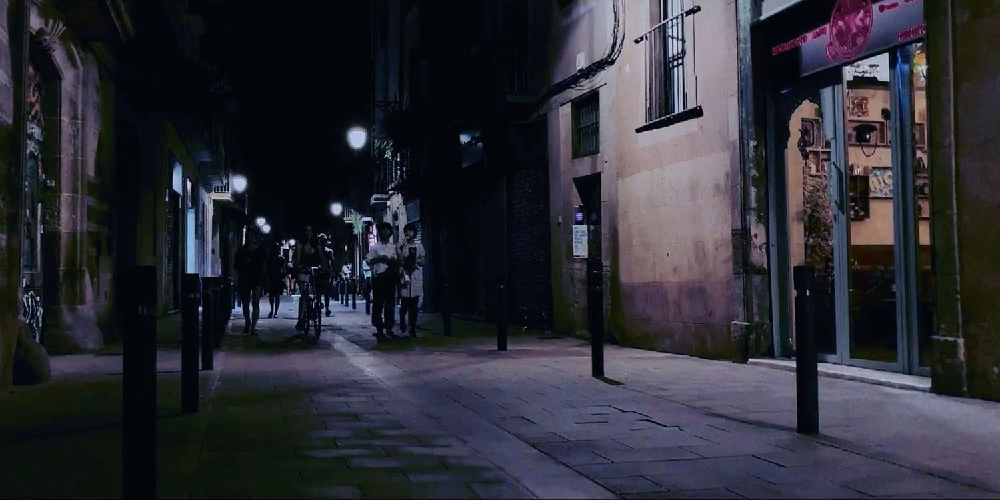
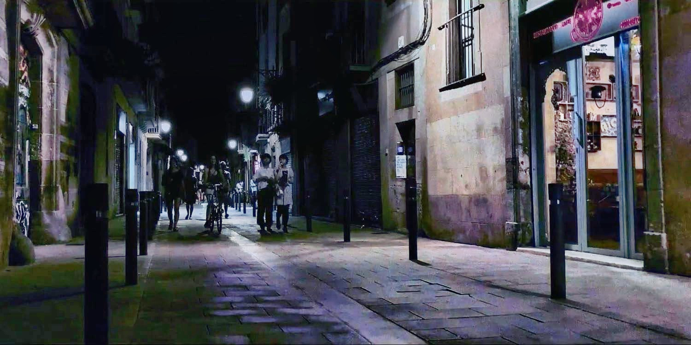

# Adaptive_Histogram_Equalization RGB Image (OpenCV)
 RGB_Adaptive_Histo_Equalization_Using_CLAHE

# Library Installations:
 
- run: 
- pip install cv2
- pip install matplotlib
- pip install numpy

# Usuage
- open Jupyter Notebook and run ( Adaptive_Histogram_Equalization_RGB.ipynb ) 

# Reference
- https://docs.opencv.org/master/d5/daf/tutorial_py_histogram_equalization.html
- https://www.pyimagesearch.com/2021/02/01/opencv-histogram-equalization-and-adaptive-histogram-equalization-clahe/

If you like this work please help me by giving me some stars.
